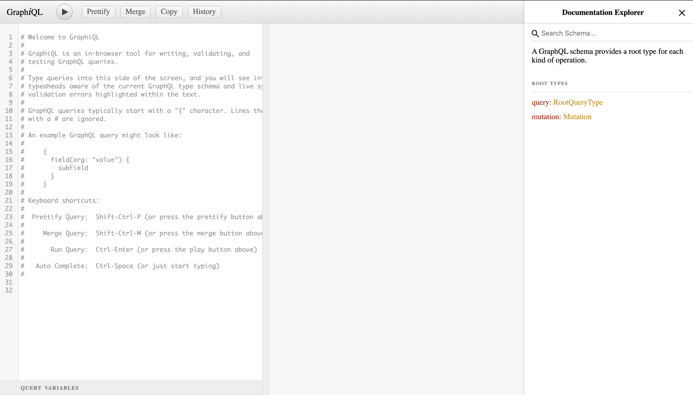
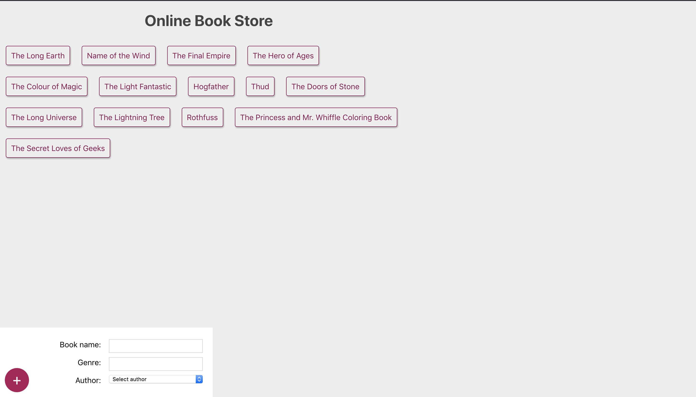
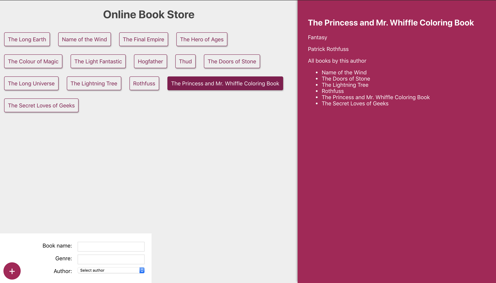

## Online Book Store

### Getting Started

- Clone the repository: `git clone https://github.com/einnor/book-store.git`

#### Start the server

- `cd server`
- `yarn install`
- `yarn global add nodemon`
- `yarn run start`
- Browse to `localhost:4000/graphql`

#### Start the client

- `cd client`
- `yarn install`
- `yarn run start`
- Browse to `localhost:3000`

